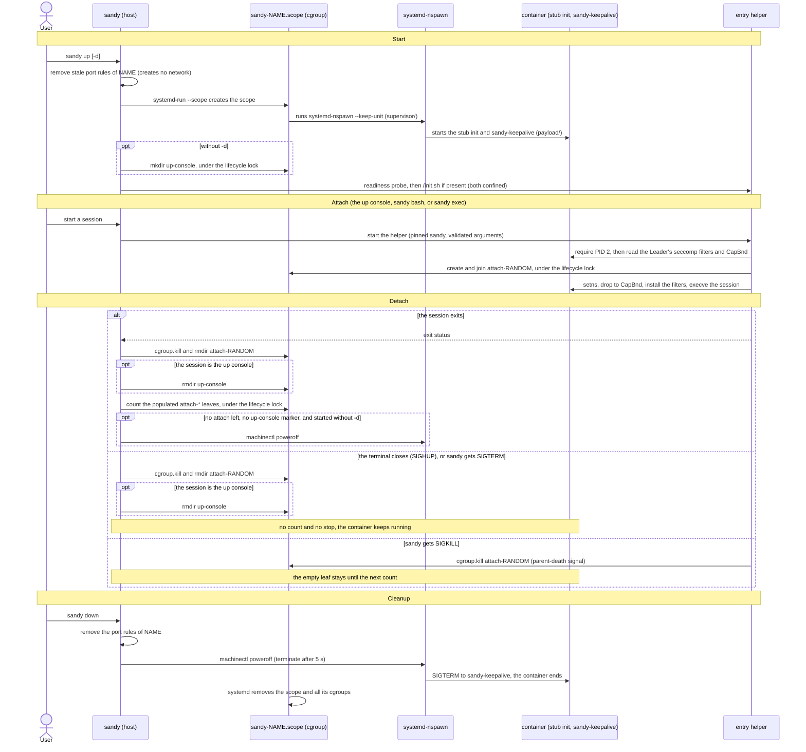

# sandy

`sandy` is a CLI for building and operating development containers on top of
`systemd-nspawn`. The project focuses on reproducible environments for AI agent
work.

Disclaimer: While `sandy` was written with security in mind, it is a side
project intended to explore AI sandboxing using `systemd-nspawn`, should be
considered experimental and should not be used on production systems. Because
it is experimental, it may change incompatibly at any time.

`sandy` originally started as a python reimplementation of the CLI for a docker
wrapper written by Trevor Hilton (@hiltontj).


## Features

- Container lifecycle management
- OCI or `debootstrap` based bootstrapping
- Uses ephemeral containers (read-only) by default with opt-in writable root
- Workspace sharing
- Host (wide-open) or bridged (`sandybr0`) networking (private with lenient
  egress with optional port forwarding)


## Requirements

- Linux host with `systemd-nspawn`, `machinectl`, `systemd-run`, `systemctl`,
  `ip`, ... and the unified cgroup v2 hierarchy with `cgroup.kill` (Linux 5.14
  or later)
- Either `debootstrap` **or** the combination of `skopeo` and `umoci` for image
  creation
- Firewall tooling: `iptables` or `nftables` as a fallback for NAT rules with
  bridged networking
- Root privileges
- Directory layout: currently manages root filesystems in `/var/lib/machines`
  (all prefixed with `sandy.`).

Root-owned `sandy.<name>` image symlinks in `/var/lib/machines` are supported,
matching `machinectl`'s documented image layout. Symlinks inside an image are
resolved within that image's pinned root and cannot escape to the host. Removing
a symlinked image removes the link, not the administrator-managed external
target.


### Getting Started

1. Install required packages on the host (example for Debian/Ubuntu):
   ```bash
   sudo apt-get update
   sudo apt-get install -y systemd-container debootstrap iptables skopeo umoci
   ```
   Install only the tools you intend to use (eg, `sandy auto-detects OCI vs.
   `debootstrap` support)
2. When run from the checked out directory, `sandy` will look for the
   `debootstrap.sh`, `oci.sh`, `sandy-keepalive.sh` and `setup-container.sh`
   helper scripts. If copying `sandy` to another directory, put these scripts
   next to `sandy`
   (also see the `SANDY_...` environment variables from `--help`)
3. Ensure `/var/lib/machines` exists as described above.
4. Run `sandy` as root (`sudo /path/to/sandy ...`). By default it mounts the
   `workspace` subdirectory for the developer user.


## Usage

### Quick start

```bash
# share files with the container
$ mkdir workspace && cp ... ./workspace

# create the 'ai-dev' container and use it
$ sudo sandy up -b
I: Using OCI method to create 'debian:trixie-slim' container
I: Pulling 'debian:trixie-slim'
...

developer@ai-dev:~/workspace$ claude|codex|copilot|gemini|...
...
developer@ai-dev:~/workspace$ exit
Container ai-dev exited successfully.

# use an existing container
# Tip: use --persistent after building containers to login to any AI account(s)
$ sudo sandy up --persistent
...
$ developer@ai-dev:~/workspace$ claude
... login then /quit ...
$ developer@ai-dev:~/workspace$ exit

# afterward, omit --persistent
$ sudo sandy up
Running: sudo ~/code/dev/sandy/sandy up
I: Mounting '/home/jamie/code/workspace' on '/home/developer/workspace'
I: Bind mounting /init.sh as read-only
I: Starting 'ai-dev'
...
developer@ai-dev:~/workspace$
...
$ developer@ai-dev:~/workspace$ exit

# create a chat session with an AI agent
$ mkdir workspace/chat && cd workspace
$ sudo sandy -c chat -w chat up -b --persistent  # once, create 'chat'
$ developer@ai-dev:~/workspace$ claude
... <login> /quit ...
$ developer@ai-dev:~/workspace$ exit
$ sudo sandy -c chat -w chat up -d               # if needed, start detached
$ sudo sandy -c chat -w chat exec claude         # run a command
```

The general invocation is:
```bash
$ sudo /path/to/sandy [GLOBAL OPTIONS] [COMMAND] [COMMAND OPTIONS]
```


### Global options
- `-w, --workspace PATH` - relative workspace to bind-mount inside the
  container (validated to prevent traversal; default: `workspace`).
- `-c, --container NAME` - container identifier (RFC-compliant hostname;
  default: `ai-dev`).
- `-u, --user USERNAME` - in-container user (POSIX-compliant name; default:
  `developer`).


### Commands
- `up` - Build and start the container, then attach a console session.
  When the console exits, the container stops, unless another `bash` or
  `exec` session is still attached; then the last session to exit stops it.
  Key flags:
  - `--build` to create a container
  - `--detach` starts the container without a console and leaves it running
    in the background. Only `down` or `rm` stops it.
  - `--persistent` keeps the instance running across CLI exits
  - `--network {host,lenient}` chooses host networking or an isolated bridge
    (default `lenient`).
  - `--port proto:host:container` forwards 127.0.0.1 traffic (e.g., `--port
    tcp:8080:80`). Multiple flags allowed.
- `down` - Stop the container
- `rm` - Remove containers, cache, or network artifacts. Accepts `--all`,
  `--force`, `--cache`, `--network`.
- `bash` - Launch an interactive shell inside the running container (default
  when no command is supplied).
- `exec` - Execute a specific command in the running container
  (`./sandy exec -- cargo test`).

`bash` and `exec` attach to a container that `up` started. They run with the
same seccomp filters and capability bounding set as the container itself, also
with `-u root` (see "Attached sessions" below).
- `status` - Show `machinectl status` for the container.
- `list` - Enumerate managed containers and their paths under
  `/var/lib/machines`.


### Networking and Port Forwarding

When `--network lenient` (default), `sandy` creates `sandybr0`, enables IP
forwarding, and creates firewall rules to block RFC1918/ULA ranges while
allowing loopback-published services via port mappings. Host networking
(`--network host`) skips bridge configuration entirely.

Port mapping state uses a persistent `0600` coordination lock in
`/var/lib/machines/sandy.__cache`. Once created, `rm --cache` retains that
empty lock and its directory so concurrent Sandy processes always coordinate
on the same inode; it contains no port mappings or cache payload. The
`lifecycle.lock` file in the same directory is retained in the same way.


## Security

Container technologies (eg, `docker`, `podman`, `incus`, etc) typically require
`root` access for various aspects of setting up containers. For usability, most
of these tools create a root-running service that exposes a socket that is used
by a corresponding client tool where the socket is guarded by group membership
such that if the user invoking the client tool is in the group, then the user
can run any commands supported by the root-running service. While this provides
user convenience, it typically means that any users with this group membership
effectively have `root` on the host (due to mounting volumes in the container,
etc).

Like other container technologies, `sandy` also requires `root` to setup up
networking, root filesystems, invoking `systemd-nspawn`, etc. Unlike the other
container technologies, `sandy` does not provide a root running service and
instead is expected to be called with `sudo` (or similar) and for transparency,
`sandy` is fairly chatty with its output.

The install target copies `sandy` and its helper scripts to a root-owned
`/usr/local/lib/sandy` directory by default:

```bash
$ git clone https://github.com/jdstrand/sandy.git
$ cd sandy
$ sudo make install
```

After copying the files, `make install` prints a sudoers example, but it never
updates sudoers. Granting a user or group permission to run `sandy` as root is
equivalent to granting unrestricted host root access. The executable path in
the example limits which command sudo may launch; it does not constrain the
host filesystems, processes, network interfaces, firewall rules, or container
state that Sandy can change. Delegate it only to users who are already trusted
with host root, and review any policy change with `visudo`:

```
%sudo	ALL=(root:root) /usr/local/lib/sandy/sandy
```

Set `INSTALL_DIR` to choose another absolute installation directory. Packagers
can set an absolute `DESTDIR`, which is prepended as a staging root. A
`DESTDIR` of `/` is equivalent to leaving it empty, and trailing slashes are
accepted.

The example limits the sudo command path to the installed `sandy` executable,
but it is not a privilege or sandbox boundary. Choosing a different group does
not reduce the effective privilege granted to members of that group.

### Attached sessions

`bash`, `exec`, and the network setup script (`/init.sh`) enter a running
container through an internal helper mode of `sandy` itself, not through
`nsenter`. The helper reads the seccomp filters and the capability bounding
set from the host, from the container's init process: the Leader that
`machinectl` reports, which is PID 1 in the container, nspawn's stub init
`(sd-stubinit)`. The container's main process (PID 2) inherits both from it.
The helper then joins the container's namespaces and applies both before it
runs the command. As a result, an attached session has the same confinement
as the container's main process, for the default user and for `-u root`. If the helper cannot read or apply the
confinement, it refuses to run the command; there is no unconfined fallback.
nspawn completes the Leader's confinement during the start, before it starts
the main process. So the helper reads the Leader only after the main process
exists. An attach before that fails with "Container is still starting; try
again" (exit status 125); `up` waits until an attach works.

Differences from earlier versions:

- There is no PAM session. `su` is no longer used; the helper sets the user,
  groups, and environment itself. The user, uid, gid, and supplementary groups
  come from the container's `/etc/passwd` and `/etc/group` at attach time.
  `root` gets no supplementary groups, as for the container's main process.
- The environment is a fixed allow-list (`HOME`, `LANG`, `LC_ALL`, `LOGNAME`,
  `PATH`, `SHELL`, `SYSTEMD_COLORS`, `TERM`, `USER`). Host variables are not
  passed.
- An attached session starts in the workspace when it exists, otherwise in
  `/`.

### Container scope and session lifecycle

`up` starts `systemd-nspawn` in its own transient systemd scope,
`sandy-<name>.scope` in `system.slice`, with no terminal and in its own
session. Because of this, the container keeps running when the terminal
closes, or when systemd stops the terminal's scope (for example, after an OOM
kill in that scope). The scope has the same resource defaults
as the machine scopes that `machinectl` creates: `TasksMax=16384`, and no
memory or CPU limit. On systemd 253 or later it also has
`OOMPolicy=continue`, so that an OOM kill of one process does not stop the
container. `up` fails if a unit with the scope's name already exists.

The container's main process is `sandy-keepalive`: the image's `/bin/bash`
running a copy of `sandy-keepalive.sh` as container root. It waits until the
container is powered off. The image must therefore provide `/bin/bash` and a
`sleep` in `PATH`. Container users other than root cannot signal it.

Each session (the `up` console, `bash`, `exec`, and `/init.sh`) runs in its own
cgroup `attach-<random>` in the container's scope, next to the container's
own processes. Its memory and processes count against the container's scope,
not against the terminal. When a session ends, `sandy` ends every process that
the session left behind and removes the cgroup. When the terminal goes away
(`SIGHUP`), or `sandy` gets `SIGTERM` or is killed, the session ends in the
same way, but the container keeps running.

The diagram shows a start, an attach, the two ways in which a session ends,
and the cleanup. `up` without `-d` attaches its console as the first
session; `up -d` skips the steps marked "without -d".



A container that stopped without `sandy` (for example, container root ended
the main process) can leave port forwarding rules and state. The next `up` of
the same name removes them. With the nftables backend, each port forwarding
rule carries the comment `sandy:<name>:<proto>:<host port>`, and `sandy`
removes exactly the rules with that comment. Rules that earlier versions added
have no comment; `rm --network` removes them. This cleanup never creates the
bridge or the firewall, also not for `up --network host`. When the bridge is
gone (for example, after a host reboot), `sandy` removes the state and the
nftables rules. The iptables rules need the address of the bridge, so any that
remain are removed by the next bridge setup or by `rm --network`.

Containers started by earlier versions of `sandy` are not in a
`sandy-<name>.scope`. `bash` and `exec` refuse to attach to them; stop them
with `down` and start them again with `up`.

As mentioned above, `sandy` was written with security in mind with the goal of
creating a strong sandbox for AI agents, but it should be understood there may
be bugs, unimplemented functionality or holes in the sandbox setup that allow
escape. As a side-project, the project's scope is for experimentation, not as a
general-purpose production sandboxing tool.


## Tests

The unit tests use Python's standard `unittest` framework and mock all
privileged container, filesystem, PTY, and firewall operations. They can be run
as an unprivileged user without installing `sandy`'s runtime tools.

```bash
make install-tools
make check
```

`make install-tools` requires Python 3.10 or newer. It creates `.venv-test` and
installs the pinned Python QA dependencies. If `language-checker` is unavailable,
the inclusivity check prints a warning and is skipped. The individual checks
are also available:

```bash
make format-check
make type-check
make test
make inclusivity-check
```

Use `make format` to apply Black formatting. Branch coverage is measured with
`make coverage`; the checked-in configuration enforces a minimum combined
branch and statement coverage of 95%.

If `language-checker` is not on `PATH`, provide its executable path explicitly:

```bash
make check LANGUAGE_CHECKER=/path/to/language-checker
```


## End to End (e2e) Tests

The end-to-end suite exercises the real root-only container, cache,
`systemd-nspawn`, mount, network, firewall, and cleanup paths. Run it only in a
disposable Linux VM. It creates and removes `/var/lib/machines/sandy.*`,
`sandybr0`, Sandy firewall rules and caches, and temporarily changes
`net.ipv4.ip_forward`. The runner refuses to start if it detects pre-existing
Sandy machine, bridge, or firewall state.

Ubuntu 24.04 (Noble) is the minimum tested guest. The VM must support nested
`systemd-nspawn` containers and user namespaces, have outbound DNS, HTTP, and
HTTPS access, and expose the normal kernel networking and firewall interfaces.
The tested VM had 4 vCPUs, 8 GiB of RAM, and a 40 GiB disk; allow at least 20
GiB of free disk space for uncached builds.

Install the host-side test requirements:

```bash
sudo apt-get update
sudo apt-get install -y \
    acl ca-certificates curl debootstrap iproute2 iptables make nftables \
    python3 skopeo systemd-container uidmap umoci util-linux
```

From a clean checkout in the disposable VM, run:

```bash
sudo env SANDY_E2E=1 make e2e
```

The opt-in variable and root check are intentional safety guards. The fast
suite uses Sandy's normal default bootstrap method and base image with a
minimal setup script. It covers cache misses, cache reuse, cache invalidation,
lifecycle operations, mounts, networking, firewall rules, port forwarding and
cleanup. Lifecycle and network tests reuse the cache created by the cache
tests.

To run the fast suite and then smoke-test one uncached build with Sandy's
complete default `setup-container.sh`, run:

```bash
sudo env SANDY_E2E=1 make e2e-full
```

The additional full build may take 10-20 minutes depending on network and
package caches because the default setup installs and compiles complete
development toolchains.
