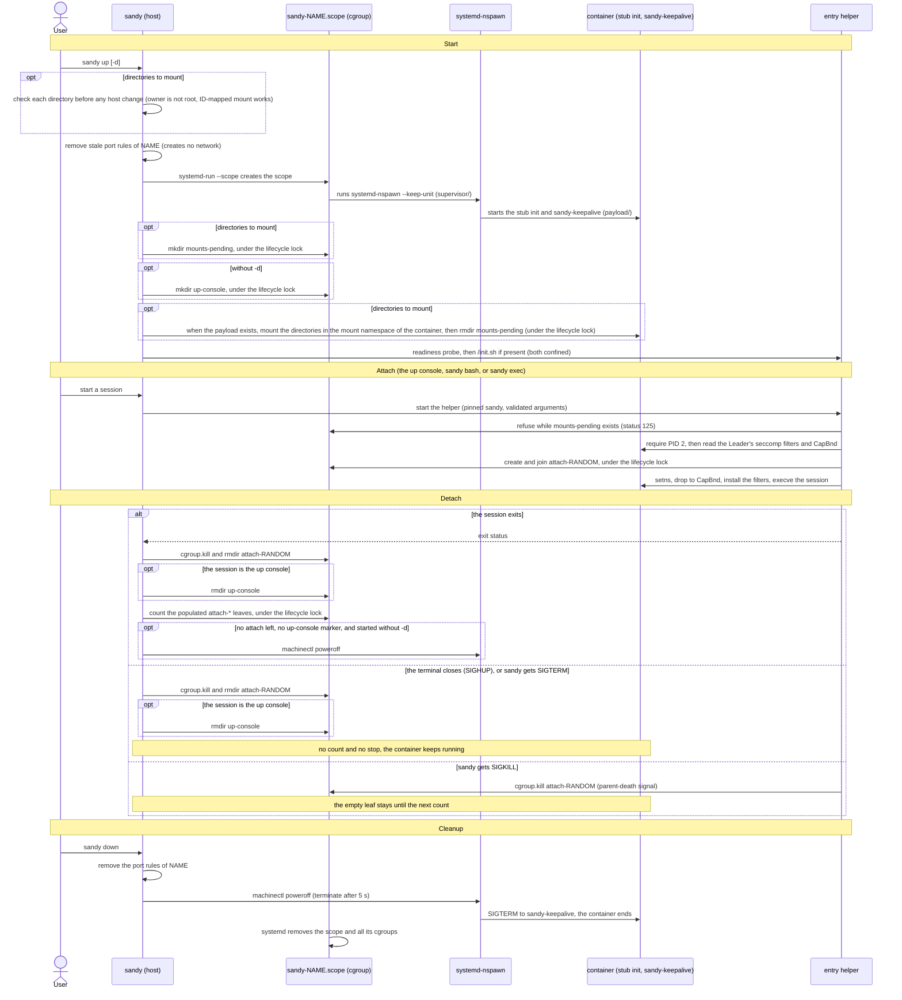

# sandy

`sandy` is a CLI for building and operating development containers on top of
`systemd-nspawn`. The project focuses on reproducible environments for AI agent
work.

Disclaimer: While `sandy` was written with security in mind, it is a side
project intended to explore AI sandboxing using `systemd-nspawn`, should be
considered experimental and should not be used on production systems. Because
it is experimental, it may change incompatibly at any time.

`sandy` originally started as a python reimplementation of the CLI for a docker
wrapper written by Trevor Hilton (@hiltontj).


## Features

- Container lifecycle management
- OCI or `debootstrap` based bootstrapping
- Uses ephemeral containers (read-only) by default with opt-in writable root
- Workspace and shared directories, mounted with an owner mapping: the host
  owner of a directory is the container user in the container, and root in
  the container cannot create files of host root
- Host (wide-open) or bridged (`sandybr0`) networking (private with lenient
  egress with optional port forwarding)


## Requirements

- Linux host with `systemd-nspawn`, `machinectl`, `systemd-run`, `systemctl`,
  `ip`, ... and the unified cgroup v2 hierarchy with `cgroup.kill` (Linux 5.14
  or later)
- For the workspace and shared directories: ID-mapped mounts. They need
  Linux 5.12 or later (the 5.14 above covers it) and a file system that
  supports them, such as ext4, xfs, or btrfs. `up` checks this before it changes
  the host
  (see "Workspace and shared directories")
- Either `debootstrap` **or** the combination of `skopeo` and `umoci` for image
  creation
- Firewall tooling: `iptables` or `nftables` as a fallback for NAT rules with
  bridged networking
- Root privileges
- Directory layout: currently manages root filesystems in `/var/lib/machines`
  (all prefixed with `sandy.`).

Root-owned `sandy.<name>` image symlinks in `/var/lib/machines` are supported,
matching `machinectl`'s documented image layout. Symlinks inside an image are
resolved within that image's pinned root and cannot escape to the host. Removing
a symlinked image removes the link, not the administrator-managed external
target.


### Getting Started

1. Install required packages on the host (example for Debian/Ubuntu):
   ```bash
   sudo apt-get update
   sudo apt-get install -y systemd-container debootstrap iptables skopeo umoci
   ```
   Install only the tools you intend to use (eg, `sandy auto-detects OCI vs.
   `debootstrap` support)
2. When run from the checked out directory, `sandy` will look for the
   `debootstrap.sh`, `oci.sh`, `sandy-keepalive.sh` and `setup-container.sh`
   helper scripts. If copying `sandy` to another directory, put these scripts
   next to `sandy`
   (also see the `SANDY_...` environment variables from `--help`)
3. Ensure `/var/lib/machines` exists as described above.
4. Run `sandy` as root (`sudo /path/to/sandy ...`). By default it mounts the
   `workspace` subdirectory for the developer user. The owner of that
   directory becomes the developer in the container (see "Workspace and
   shared directories").


## Usage

### Quick start

```bash
# share files with the container
$ mkdir workspace && cp ... ./workspace

# create the 'ai-dev' container and use it
$ sudo sandy up -b
I: Using OCI method to create 'debian:trixie-slim' container
I: Pulling 'debian:trixie-slim'
...

developer@ai-dev:~/workspace$ claude|codex|copilot|gemini|...
...
developer@ai-dev:~/workspace$ exit
Container ai-dev exited successfully.

# use an existing container
# Tip: use --persistent after building containers to login to any AI account(s)
$ sudo sandy up --persistent
...
$ developer@ai-dev:~/workspace$ claude
... login then /quit ...
$ developer@ai-dev:~/workspace$ exit

# afterward, omit --persistent
$ sudo sandy up
Running: sudo ~/code/dev/sandy/sandy up
I: Mounting '/home/jamie/code/workspace' on '/home/developer/workspace'
I: Bind mounting /init.sh as read-only
I: Starting 'ai-dev'
...
developer@ai-dev:~/workspace$
...
$ developer@ai-dev:~/workspace$ exit

# create a chat session with an AI agent
$ mkdir workspace/chat && cd workspace
$ sudo sandy -c chat -w chat up -b --persistent  # once, create 'chat'
$ developer@ai-dev:~/workspace$ claude
... <login> /quit ...
$ developer@ai-dev:~/workspace$ exit
$ sudo sandy -c chat -w chat up -d               # if needed, start detached
$ sudo sandy -c chat -w chat exec claude         # run a command
```

The general invocation is:
```bash
$ sudo /path/to/sandy [GLOBAL OPTIONS] [COMMAND] [COMMAND OPTIONS]
```


### Global options
- `-w, --workspace PATH` - host directory to mount at `~/workspace` in the
  container, relative to the current directory (validated to prevent
  traversal; default: `workspace`). See "Workspace and shared directories".
- `-s, --shared PATH` - host directory to mount at `~/shared` in the
  container (same rules as `-w`; default: none).
- `-c, --container NAME` - container identifier (RFC-compliant hostname;
  default: `ai-dev`).
- `-u, --user USERNAME` - in-container user (POSIX-compliant name; default:
  `developer`).


### Commands
- `up` - Build and start the container, then attach a console session.
  When the console exits, the container stops, unless another `bash` or
  `exec` session is still attached; then the last session to exit stops it.
  Key flags:
  - `--build` to create a container
  - `--detach` starts the container without a console and leaves it running
    in the background. Only `down` or `rm` stops it.
  - `--persistent` keeps the instance running across CLI exits
  - `--network {host,lenient}` chooses host networking or an isolated bridge
    (default `lenient`).
  - `--port proto:host:container` forwards 127.0.0.1 traffic (e.g., `--port
    tcp:8080:80`). Multiple flags allowed.
  - `--pids-limit N`, `--tmp-size SIZE`, and `--oom-score-adj N` set limits
    of this container, with the names and units of `docker run` and `podman
    run`. See "Resource limits" below.
- `down` - Stop the container
- `rm` - Remove containers, cache, or network artifacts. Accepts `--all`,
  `--force`, `--cache`, `--network`.
- `bash` - Launch an interactive shell inside the running container (default
  when no command is supplied).
- `exec` - Execute a specific command in the running container
  (`./sandy exec -- cargo test`).

`bash` and `exec` attach to a container that `up` started. They run with the
same seccomp filters and capability bounding set as the container itself, also
with `-u root` (see "Attached sessions" below).
- `status` - Show `machinectl status` for the container and its OOM kills.
- `update` - Change resource limits, as `docker update` does.
  `update --pids-limit N` changes the process limit of a running container
  until it stops. `update --shared` changes the limits that all containers
  share. See "Resource limits" below.
- `list` - Enumerate managed containers and their paths under
  `/var/lib/machines`.


### Workspace and shared directories

`-w` and `-s` name two host directories. `up` mounts them in the container at
`~/workspace` and `~/shared` of the container user (`/home/<user>/workspace`
and `/home/<user>/shared`). Sandy resolves each path once, at `up`, to its real
path, so a symbolic link such as `-w link` works. `up` prints the real path:
`I: Mounting '<real path>' on '<target>'`. A host directory that does not exist
is skipped with a warning. So is a target that the image does not have.

#### How the mounts work

- nspawn gets no bind for these directories. After the container starts, and
  as soon as its main process exists, `up` mounts each directory in the mount
  namespace of the container. It uses the system calls `open_tree`,
  `mount_setattr`, and `move_mount`. It runs no `mount` command.
- The mounts exist only inside the container. The host has no new mount while
  the container runs, and none after `down` or after any other stop (measured
  on systemd 249, 252, 255, and 257: root in the container ended the main process,
  and `machinectl terminate`). The image
  directory (for example `/var/lib/machines/sandy.<name>/home/developer/workspace`)
  stays empty. Each start mounts the directories again.
- The mounts are private. A mount that root in the container makes below
  them (for example a tmpfs) does not appear on the host, and a mount that the
  host makes below them after `up` does not appear in the container. Without
  this, the mounts were peers of the host mount: both kinds of mount crossed
  (measured on Linux 5.15, 6.1, 6.8, and 6.12), and the mount of root in the
  container stayed on the host after the container stopped. The check of this
  rule, with the final code, was done on systemd 249, 252, 255, and 257.
- Until the mounts are done, every attach fails: `bash`, `exec`, `/init.sh`,
  and the readiness probe of `up`. The message is "Container is still
  starting; try again" (exit status 125). So no session sees the empty
  directories of the image. To do this, `up` creates an empty cgroup,
  `mounts-pending`, in the scope of the container, under the lifecycle lock,
  right after the start. It removes the cgroup, under the same lock, after the
  last mount.
- If `up` ends before it removes the marker (for example, it gets `SIGKILL`),
  the container keeps running, and the marker stays until the container stops
  (measured with `SIGKILL` right after the marker was created, on systemd 249,
  252, and 257). Every attach then fails with
  `E: Container entry failed: 'Container is still starting; try again (if
  sandy up has ended, stop the container with sandy down)'`. Stop the
  container with `sudo sandy down`.
- A failed mount stops the container. `up` prints the source, the target, the
  failed step, and the errno, for example `E: Could not mount '<source>' on
  '<target>': move_mount failed: Invalid argument (errno 22)`. The container
  also stops, with `E: Container '<name>' did not become ready`, when it has no
  main process after 60 seconds.

#### Owner mapping

`up` reads the uid and gid of the container user from `/etc/passwd` in the
image. (In a Debian image, `developer` has uid 1000. In an Ubuntu 26.04 image,
`ubuntu` has uid 1000, and `developer` has uid 1001.) `up` then maps the uid
and gid of the owner of the host directory to that user. No other id maps.

- For the files in the directory, the host owner and the container user are
  the same user. The container user can read, write, rename, and delete files
  that the host owner made, as the mode bits allow. Files that the container
  user creates belong to the host owner and to the group of the host
  directory (measured on systemd 249, 252, 255, and 257: a directory with owner
  1234 and group 100 gave new files and directories with 1234:100). The host
  owner can read, write, and delete them.
- Any host uid works. It does not need to equal the uid of the container user.
  `up` reads the ids of the container user from the image, so the mapping
  follows the image. Measured: host uid 1234 with a developer at uid 1000.
- Files of other owners, host root included, show in the container with the
  overflow id 65534. The container user can use them only through the "other"
  mode bits.
- Root in the container (`sandy -u root`), and every container id other than
  the container user, gets the error "Value too large for defined data type"
  (`EOVERFLOW`) when it creates a file or a directory there. So the container
  cannot create files of host root, such as a setuid-root file.
- Root in the container can still change the mode of files that belong to the
  host owner, for example with `chmod 4755`. The host then has a setuid file of
  the host user. It is never a file of root. See "Running files that the
  container made".

These facts were measured on systemd 249, 252, 255, and 257 (Linux 5.15, 6.1,
6.8, and 6.12, x86_64) with the Debian image and a host owner with uid 1234.

#### Mount options

Both mounts, the workspace and the shared directory, are `nosuid`, `nodev`,
ID-mapped, and private. `/proc/self/mountinfo` in the container shows
`rw,nosuid,nodev,relatime,idmapped` for `/home/developer/workspace` and for
`/home/developer/shared` (measured on systemd 249, 252, 255, and 257). `nosuid`
works: a setuid file of the container user (mode 4755), run by root in the
container, kept effective uid 0, so the kernel ignored the bit (measured on
systemd 249, 252, 255, and 257). The `nodev` flag is set; device files on the mounts
were not tested.

The mounts are not `noexec`. The agent builds and runs programs in the
workspace.

`nosuid` limits the container user, not root in the container. Root in the
container can remount the workspace without `nosuid`: `mount -o remount,bind,suid
/home/developer/workspace` ended with status 0, and `/proc/self/mountinfo` then
showed `rw,nodev,relatime,idmapped` (measured with the final code on systemd
249, 252, 255, and 257). The kernel does not lock the flag. The owner mapping, not
`nosuid`, keeps files of host root out of the directories.

#### Checks before the start

Before `up` changes anything on the host, it checks each directory:

1. The directory must exist and be a directory. If it does not, `up` prints
   `W: Could not find '<path>' on the host, skipping workspace mount` (or
   `shared`) and continues without that mount.
2. Root must not own it, as user or as group (uid 0 or gid 0). A container
   process that writes there would create files that root owns. `up` exits with
   status 1 and prints `E: Cannot mount '<path>' as the workspace directory:
   root owns the workspace directory, so files that the container creates there
   would belong to root. Use a directory that a regular user and group own`.
   Change the owner first, for example with `sudo chown USER:GROUP DIR`.
3. The kernel and the file system must support ID-mapped mounts. `up` makes a
   test mount that it drops at once. The test changes nothing on the host. If it
   fails, `up` exits with status 1, for example `E: Cannot mount '<path>' as the
   workspace directory: mount_setattr failed: Invalid argument (errno 22).
   ID-mapped mounts need Linux 5.12 or later and a file system that supports
   them (ext4, xfs, and btrfs do; tmpfs needs Linux 6.3; ramfs does not)`.

4. The host may have mounts below the directory. `up` does not stop. It prints
   a warning and goes on (see "Mounts below the directory"):
   `W: The workspace directory '<path>' has mounts below it: '<path>/a',
   '<path>/b'` and the line `   The container does not see these mounts`. It
   lists three mounts at most, and the number of the others. If `up` cannot read the mount table, it prints `W:
   Could not check for mounts below the workspace directory: ...` and goes on.

After the image exists (after `--build`), and before the start, `up` also reads
the uid and gid of the container user from `/etc/passwd` in the image. If the
file has no entry for the user, or more than one, `up` exits with status 1 and
prints `E: Could not read the uid and gid of '<user>' in the container image:
...`. It stops before it starts the container or sets up the bridge.

Test mounts on x86_64 (the kernel versions are those of the hosts with systemd
249, 252, 255, and 257):

| File system | Linux 5.15 | Linux 6.1 | Linux 6.8 | Linux 6.12 |
| --- | --- | --- | --- | --- |
| ext4 | works | works | works | works |
| xfs | works | works | works | works |
| btrfs | works | works | works | works |
| tmpfs | refused | refused | works | works |
| ramfs | refused | refused | refused | refused |

"Refused" is `mount_setattr failed: Invalid argument (errno 22)`. xfs and
btrfs were mounted from loop devices. Not measured: NFS, other file systems, and
aarch64.

#### Mounts below the directory

A file system that the host has mounted below the workspace directory is not
visible in the container. The container sees the directory below the mount
point. That directory is empty when the host mounted over an empty directory.
This holds for a tmpfs and for a bind mount at `workspace/sub` (measured on
systemd 249, 252, 255, and 257). It also holds for a mount that the host makes
after `up`, because the mounts are private. `up` clones the directory without
the mounts below it (`open_tree` with `OPEN_TREE_CLONE` and without
`AT_RECURSIVE`). `up` warns when the host has such mounts (see "Checks before
the start").

Earlier versions behaved in another way (measured with the code before this
change):

- On systemd 249, the nspawn bind was recursive. The container saw the mounts
  below the directory, a tmpfs and a bind mount.
- On systemd 250 or later, the bind was recursive and ID-mapped (`:idmap`). `up`
  failed when the host had a mount below the directory. systemd-nspawn printed
  `Failed to map ids for bind mount ...: Device or resource busy` (measured
  directly with systemd-nspawn 255 and 257, for a tmpfs, for a bind mount, and
  for both). With Sandy, `up` ended with `Container '<name>' exited before it
  was ready` (measured on systemd 252, 255, and 257 with a tmpfs and a bind
  mount below the workspace).

So `up` now starts in both cases. On systemd 250 or later the container starts
where it did not start before. On systemd 249 the container no longer sees the
mounts.

Sandy does not include the mounts below the directory. A prototype of the same
system calls, with `AT_RECURSIVE` on the clone and on the attribute change,
showed these results on Linux 5.15, 6.1, 6.8, and 6.12:

- The ID map must apply to every mount in the tree. The whole mount fails
  (`mount_setattr` `EINVAL`) when one mount below does not support it. This
  happened for ramfs, an autofs mount point, and a FUSE file system (`bindfs`;
  tested on Linux 6.12 only), and for a tmpfs on Linux 5.15 and 6.1. A tmpfs
  below works on Linux 6.8 and 6.12. A bind mount of an ext4 directory works on
  all four kernels.
- When the recursive mount works, files of other owners below the directory show
  as 65534. Files of the owner of the directory show as the container user.
- If only the clone is recursive, and the attribute change is not, the mounts
  below the directory appear without `nosuid`, `nodev`, and the ID map.

So a recursive mount fails in the cases where people use mounts below a
workspace, and it needs two flags that must stay together. Not tested: NFS.

The change protects the host: a mount below the workspace, for example a
secret store or the data of another user, does not enter the container. It is
also a limit. To use such a file system in the container, name its directory
with `-s`. A bind mount of a directory works as the source of `-s` (measured
on systemd 249, 252, 255, and 257: the container saw the files, and a file that the
container user created belonged to the host owner). Whether a tmpfs works as
the source depends on the kernel (see the table above). Sandy has no option for
more than the two mounts.

#### Differences from earlier versions

- On systemd 250 or later, earlier versions bound the directories with
  `--bind=...:idmap`. That option maps each container id to the same host id.
  The container user could write only when the host uid was equal to the uid of
  the image user. With host uid 1234, or with an Ubuntu 26.04 image, the result
  was "Permission denied" (measured on systemd 252, 255, and 257). Root in the
  container could create files of host root there (measured on systemd 255 and
  257: a root-owned file with mode 4755), and the bind was not `nosuid`.
- On systemd 249, earlier versions used ACLs. Sandy ran `setfacl` and asked for
  confirmation. Files that the container made belonged to host uid 1000000 plus
  the container uid, and the host user could not edit or delete them
  (measured). Sandy now has no ACL step, asks no question in `up`, does not read
  `SUDO_UID`, and needs neither `setfacl` nor `setpriv`.
- One method now works on every systemd version, from 249.
- Mounts below the directory: on systemd 249 the container saw them, and on
  systemd 250 or later `up` failed when there was one. Now `up` starts, the
  container does not see them, and `up` warns (see "Mounts below the
  directory").
- The directories are `nosuid` and `nodev`. Before, they were neither.
- Root in the container cannot create files in the directories any more.
- `up` refuses a directory that root owns, and a file system without support
  for ID-mapped mounts, before it changes the host.
- `bash` and `exec` fail with "Container is still starting; try again" until
  the mounts are done.


### Networking and Port Forwarding

When `--network lenient` (default), `sandy` creates `sandybr0`, enables IP
forwarding, and creates firewall rules to block RFC1918/ULA ranges while
allowing loopback-published services via port mappings. Host networking
(`--network host`) skips bridge configuration entirely.

Port mapping state uses a persistent `0600` coordination lock in
`/var/lib/machines/sandy.__cache`. Once created, `rm --cache` retains that
empty lock and its directory so concurrent Sandy processes always coordinate
on the same inode; it contains no port mappings or cache payload. The
`lifecycle.lock` and `shared_limits.lock` files in the same directory are
retained in the same way. `rm --cache` also keeps `shared_limits.json`, the
shared limits that `update --shared` saved.


## Security

Container technologies (eg, `docker`, `podman`, `incus`, etc) typically require
`root` access for various aspects of setting up containers. For usability, most
of these tools create a root-running service that exposes a socket that is used
by a corresponding client tool where the socket is guarded by group membership
such that if the user invoking the client tool is in the group, then the user
can run any commands supported by the root-running service. While this provides
user convenience, it typically means that any users with this group membership
effectively have `root` on the host (due to mounting volumes in the container,
etc).

Like other container technologies, `sandy` also requires `root` to setup up
networking, root filesystems, invoking `systemd-nspawn`, etc. Unlike the other
container technologies, `sandy` does not provide a root running service and
instead is expected to be called with `sudo` (or similar) and for transparency,
`sandy` is fairly chatty with its output.

The install target copies `sandy` and its helper scripts to a root-owned
`/usr/local/lib/sandy` directory by default:

```bash
$ git clone https://github.com/jdstrand/sandy.git
$ cd sandy
$ sudo make install
```

After copying the files, `make install` prints a sudoers example, but it never
updates sudoers. Granting a user or group permission to run `sandy` as root is
equivalent to granting unrestricted host root access. The executable path in
the example limits which command sudo may launch; it does not constrain the
host filesystems, processes, network interfaces, firewall rules, or container
state that Sandy can change. Delegate it only to users who are already trusted
with host root, and review any policy change with `visudo`:

```
%sudo	ALL=(root:root) /usr/local/lib/sandy/sandy
```

Set `INSTALL_DIR` to choose another absolute installation directory. Packagers
can set an absolute `DESTDIR`, which is prepended as a staging root. A
`DESTDIR` of `/` is equivalent to leaving it empty, and trailing slashes are
accepted.

The example limits the sudo command path to the installed `sandy` executable,
but it is not a privilege or sandbox boundary. Choosing a different group does
not reduce the effective privilege granted to members of that group.

### Attached sessions

`bash`, `exec`, and the network setup script (`/init.sh`) enter a running
container through an internal helper mode of `sandy` itself, not through
`nsenter`. The helper reads the seccomp filters and the capability bounding
set from the host, from the container's init process: the Leader that
`machinectl` reports, which is PID 1 in the container, nspawn's stub init
`(sd-stubinit)`. The container's main process (PID 2) inherits both from it.
The helper then joins the container's namespaces and applies both before it
runs the command. As a result, an attached session has the same confinement
as the container's main process, for the default user and for `-u root`. If the helper cannot read or apply the
confinement, it refuses to run the command; there is no unconfined fallback.
nspawn completes the Leader's confinement during the start, before it starts
the main process. So the helper reads the Leader only after the main process
exists. An attach before that fails with "Container is still starting; try
again" (exit status 125); `up` waits until an attach works. The same message
and status apply until `up` has mounted the workspace and shared directories
(see "Workspace and shared directories"). Only then does an attach work, so no
session sees the empty directories of the image.

Differences from earlier versions:

- There is no PAM session. `su` is no longer used; the helper sets the user,
  groups, and environment itself. The user, uid, gid, and supplementary groups
  come from the container's `/etc/passwd` and `/etc/group` at attach time.
  `root` gets no supplementary groups, as for the container's main process.
- The environment is a fixed allow-list (`HOME`, `LANG`, `LC_ALL`, `LOGNAME`,
  `PATH`, `SHELL`, `SYSTEMD_COLORS`, `TERM`, `USER`). Host variables are not
  passed.
- An attached session starts in the workspace when it exists, otherwise in
  `/`.

### Container scope and session lifecycle

`up` starts `systemd-nspawn` in its own transient systemd scope,
`sandy-<name>.scope` in `sandy.slice`, with no terminal and in its own
session. Because of this, the container keeps running when the terminal
closes, or when systemd stops the terminal's scope (for example, after an OOM
kill in that scope). The scope holds the process limit of the container, and
`sandy.slice` holds the limits that all containers share (see "Resource
limits" below). On systemd 253 or later the scope also has
`OOMPolicy=continue`, so that an OOM kill of one process does not stop the
container. `up` fails if a unit with the scope's name already exists.

The container's main process is `sandy-keepalive`: the image's `/bin/bash`
running a copy of `sandy-keepalive.sh` as container root. It waits until the
container is powered off. The image must therefore provide `/bin/bash` and a
`sleep` in `PATH`. Container users other than root cannot signal it.

Each session (the `up` console, `bash`, `exec`, and `/init.sh`) runs in its own
cgroup `attach-<random>` in the container's scope, next to the container's
own processes. Its memory and processes count against the container's scope,
not against the terminal. When a session ends, `sandy` ends every process that
the session left behind and removes the cgroup. When the terminal goes away
(`SIGHUP`), or `sandy` gets `SIGTERM` or is killed, the session ends in the
same way, but the container keeps running.

The diagram shows a start, an attach, the two ways in which a session ends,
and the cleanup. `up` without `-d` attaches its console as the first
session; `up -d` skips the steps marked "without -d". The steps marked
"directories to mount" happen when `up` has a workspace or shared directory to
mount (see "Workspace and shared directories").



A container that stopped without `sandy` (for example, container root ended
the main process) can leave port forwarding rules and state. The next `up` of
the same name removes them. With the nftables backend, each port forwarding
rule carries the comment `sandy:<name>:<proto>:<host port>`, and `sandy`
removes exactly the rules with that comment. Rules that earlier versions added
have no comment; `rm --network` removes them. This cleanup never creates the
bridge or the firewall, also not for `up --network host`. When the bridge is
gone (for example, after a host reboot), `sandy` removes the state and the
nftables rules. The iptables rules need the address of the bridge, so any that
remain are removed by the next bridge setup or by `rm --network`.

Containers that earlier versions of `sandy` started are not in a
`sandy-<name>.scope` in `sandy.slice`. `bash` and `exec` refuse to attach to
them; stop them with `down` and start them again with `up`.

### Running files that the container made

The container user writes the workspace and shared directories, and the files
belong to the host owner. A program on the host that runs, loads, or reads
those files does so with the rights of the host owner. The content comes from
an agent that can be wrong or hostile. The owner mapping stops files of host
root. It does not make the content safe.

These things on the host run or interpret files of the workspace:

- Git hooks (`.git/hooks`), and settings in `.git/config`: `core.hooksPath`,
  `core.fsmonitor`, and filter and diff drivers.
- Build and package scripts: `make`, `npm` and `pip` install scripts,
  `setup.py`, `build.rs`, Gradle and Maven plugins, test runners, and helper
  scripts of CI.
- `.envrc` (direnv), and other files that a tool runs when you enter the
  directory.
- Editor and IDE tasks and settings, such as `.vscode/tasks.json` and
  `.idea`.
- Shell startup files, when the workspace or the shared directory is a home
  directory.
- Programs, scripts, and libraries that the agent made, and libraries that a
  program on the host loads from the directory.
- Setuid files. Root in the container can set the setuid bit on files of the
  host owner. Such a file runs with the uid of the host owner, never as root.
- Symbolic links that point outside the directory. A program on the host
  follows them with the rights of the host owner. In the container, such a link
  points to a path of the container.

Sandy sets no size limit on these directories, so the container can fill the
file system of the host.

To reduce the risk:

- Review what the agent changed before you run anything on the host. Look at
  hooks and configuration files too: `git diff` does not show `.git`.
- Run builds, tests, and install scripts of that code inside the container, or
  in another disposable environment, not on the host.
- Do not open the workspace in an editor or IDE that runs workspace tasks or
  loads workspace settings without asking.
- Use a directory only for this work. Do not use your home directory, and do
  not use a directory that holds other projects.
- Keep secrets out of the workspace and the shared directory. The container
  can read all files there.

### Resource limits

Sandy constrains AI agents, so it sets limits by default. The design is
similar in concept to the `kubepods` cgroup of Kubernetes: all containers
run in one shared cgroup, `sandy.slice`, and the host keeps a reserve
outside of it. Each container is a scope in the slice, with settings of its
own inside the shared limits. A process that grows past the shared memory is
killed inside the containers, not on the host.

The flags have the names and units of `docker run` and `podman run`. Sizes
are a number with an optional unit `b`, `k`, `m`, or `g` (powers of 1024),
such as `8g`.

| Limit | Default | Change it with |
| --- | --- | --- |
| CPUs (shared) | all online CPUs except the lowest-numbered ones, which the host keeps: 1 CPU, 2 CPUs from 8, and 4 CPUs from 16 | `update --shared --cpuset-cpus LIST` |
| Memory (shared) | the host keeps 25% of its memory, at least 4 GiB, never more than half | `update --shared -m SIZE` (`0`: no limit) |
| Processes (shared) | the same share of the system task limit | `update --shared --pids-limit N` (`-1`: no limit) |
| Processes (per container) | 25% of the shared process limit, at least 8192, never more than half of it | `up --pids-limit N`, `update --pids-limit N` (`-1`: no limit of its own) |
| `/tmp` (per container) | 512 MiB | `up --tmp-size SIZE` (`0`: the tmpfs default, half of the host memory) |
| Swap | none | - |
| OOM score adjustment (per container) | the value of the `sandy` process | `up --oom-score-adj N` |

Examples of the defaults: a host with 4 GiB of memory shares 2 GiB with the
containers, 8 GiB shares 4 GiB, 16 GiB shares 12 GiB, and 64 GiB shares 48
GiB. The system task limit is the smaller of `kernel.threads-max` and
`kernel.pid_max`; `threads-max` grows with the memory. With 16 GiB of memory
it is about 131072, so the containers share about 98304 tasks, and each
container gets about 24576 by default. `up` prints the limits of all
containers and of the new container, and warns when `--pids-limit` is above
the shared process limit or `/tmp` is larger than the shared memory.

Files in `/tmp` use memory and count against the shared memory. A full
`/tmp` gives "No space left on device" only when it is smaller than the
memory that is free; a larger `/tmp` can make the kernel end processes
instead.

`sudo sandy update --shared [--cpuset-cpus LIST] [-m SIZE] [--pids-limit N]`
changes the shared limits, with or without running containers. The new
limits apply at once, also to running containers, and `sandy` saves them in
`shared_limits.json` in the cache directory. Each `up` sets the saved limits
(otherwise the defaults) on `sandy.slice` again, so they also apply after a
reboot or an outside change. `update --shared --reset` forgets the saved
limits and sets the defaults. `--cpuset-cpus` takes CPU numbers and ranges,
such as `4-15` or `0,2,4-7`, of online CPUs. A lower memory limit than the
containers use now makes the kernel end processes at once. A malformed
`shared_limits.json` stops `up` until `update --shared --reset`.

`sudo sandy -c NAME update --pids-limit N` changes the process limit of a
running container. The change ends with the container; the next `up` uses
its own flags. A container has no CPU or memory limit of its own.

When the shared memory runs out, the kernel ends the process with the
highest score in `sandy.slice`. The score is the memory use of the process
plus its OOM score adjustment times the shared memory / 1000 (when the host
has swap, the kernel adds the swap size to the shared memory). So with 12
GiB of shared memory and no swap, `--oom-score-adj -500` subtracts 6 GiB
from the score of each process of the container. Use it to protect a
long-running container, such as a chat session with an agent, from a build
in another container. Or give positive values to the containers that may
die first. The values are
from -999 to 1000; `-1000` (never kill) is not allowed. The container and
each `bash` and `exec` session get the value. Processes in the container,
also container root, cannot set a lower value. The value also applies when
the host runs out of memory; the kernel then prefers to end host processes
before a protected container.

Processes in a container see the shared CPUs, for example with `nproc`.
They do not see the memory or process limits: `/proc/meminfo` shows the
host memory. When the kernel ends processes of a container because memory
ran out, the `up` console, `bash`, and `exec` report it when the session
ends: the limit that the containers share, a memory limit of the container
itself (Sandy sets none, but container root can set one in its own cgroups),
or the memory of the host. `status` shows the counts.

As mentioned above, `sandy` was written with security in mind with the goal of
creating a strong sandbox for AI agents, but it should be understood there may
be bugs, unimplemented functionality or holes in the sandbox setup that allow
escape. As a side-project, the project's scope is for experimentation, not as a
general-purpose production sandboxing tool.


## Tests

The unit tests use Python's standard `unittest` framework and mock all
privileged container, filesystem, PTY, and firewall operations. They can be run
as an unprivileged user without installing `sandy`'s runtime tools.

```bash
make install-tools
make check
```

`make install-tools` requires Python 3.10 or newer. It creates `.venv-test` and
installs the pinned Python QA dependencies. If `language-checker` is unavailable,
the inclusivity check prints a warning and is skipped. The individual checks
are also available:

```bash
make format-check
make type-check
make test
make inclusivity-check
```

Use `make format` to apply Black formatting. Branch coverage is measured with
`make coverage`; the checked-in configuration enforces a minimum combined
branch and statement coverage of 95%.

If `language-checker` is not on `PATH`, provide its executable path explicitly:

```bash
make check LANGUAGE_CHECKER=/path/to/language-checker
```


## End to End (e2e) Tests

The end-to-end suite exercises the real root-only container, cache,
`systemd-nspawn`, mount, network, firewall, and cleanup paths. Run it only in a
disposable Linux VM. It creates and removes `/var/lib/machines/sandy.*`,
`sandybr0`, Sandy firewall rules and caches, and the state of `sandy.slice`,
and temporarily changes `net.ipv4.ip_forward`. The runner refuses to start if
it detects pre-existing Sandy machine, bridge, firewall, or `sandy.slice`
state, or leftover `/tmp/sandy-keepalive-*` or `/tmp/sandy-init-*` directories.
(`up` makes these directories for its binds and removes them when it ends. One
stays when `up` gets `SIGKILL`; remove such a directory by hand.)

Ubuntu 24.04 (Noble) is the minimum tested guest. The VM must support nested
`systemd-nspawn` containers and user namespaces, have outbound DNS, HTTP, and
HTTPS access, and expose the normal kernel networking and firewall interfaces.
The tested VM had 4 vCPUs, 8 GiB of RAM, and a 40 GiB disk; allow at least 20
GiB of free disk space for uncached builds.

Install the host-side test requirements:

```bash
sudo apt-get update
sudo apt-get install -y \
    ca-certificates curl debootstrap iproute2 iptables make nftables \
    python3 skopeo systemd-container uidmap umoci util-linux
```

From a clean checkout in the disposable VM, run:

```bash
sudo env SANDY_E2E=1 make e2e
```

The opt-in variable and root check are intentional safety guards. The fast
suite uses Sandy's normal default bootstrap method and base image (unless you
set `SANDY_E2E_BASE_IMAGE`) with a minimal setup script. It covers cache
misses, cache reuse, cache invalidation, lifecycle operations, mounts,
networking, firewall rules, port forwarding and cleanup. Lifecycle and network
tests reuse the cache created by the cache tests.

Two optional environment variables choose the host user and the image:

- `SANDY_E2E_HOST_UID` is the uid and gid that own the E2E workspace and shared
  directories, and the ids of the host user (a number from 1 to 60000). Without
  it, the owner is 1234 and the group is 2345. These differ from each other and
  from the ids of the container user, which the image decides. So the mount
  cases fail for a map that swaps the uid and the gid, or that keeps a host id.
  With the default image, set it to 1000 to test a host user that has the ids
  of the container user.
- `SANDY_E2E_BASE_IMAGE` is a base image, for example `ubuntu:26.04`. The
  runner passes it to Sandy as `SANDY_BOOTSTRAP_BASE`. Without it, the suite
  uses Sandy's default base image. In the Ubuntu 26.04 image, uid 1000 is
  `ubuntu`, and `developer` has uid 1001.

The runner rejects a malformed value before it creates anything. For example:

```bash
sudo env SANDY_E2E=1 SANDY_E2E_HOST_UID=1000 SANDY_E2E_BASE_IMAGE=ubuntu:26.04 make e2e
```

To run the fast suite and then smoke-test one uncached build with Sandy's
complete default `setup-container.sh`, run:

```bash
sudo env SANDY_E2E=1 make e2e-full
```

The additional full build may take 10-20 minutes depending on network and
package caches because the default setup installs and compiles complete
development toolchains.
